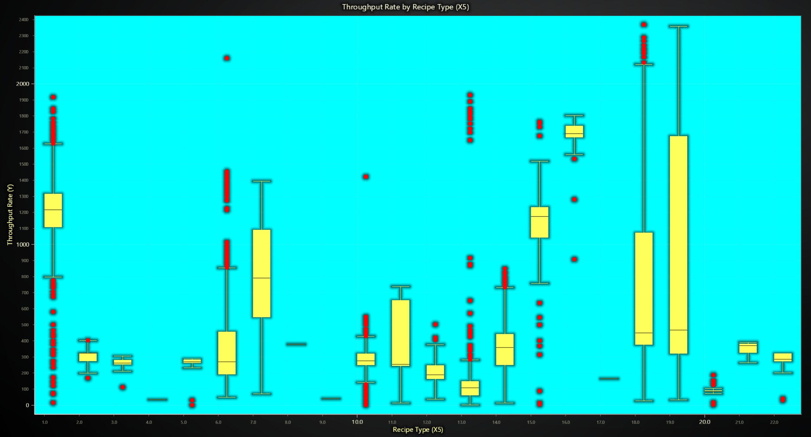
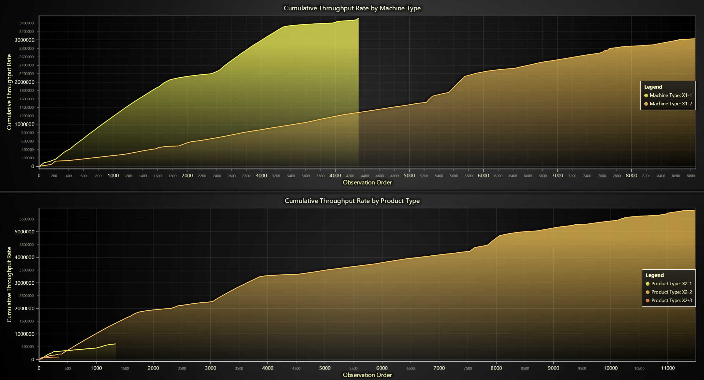
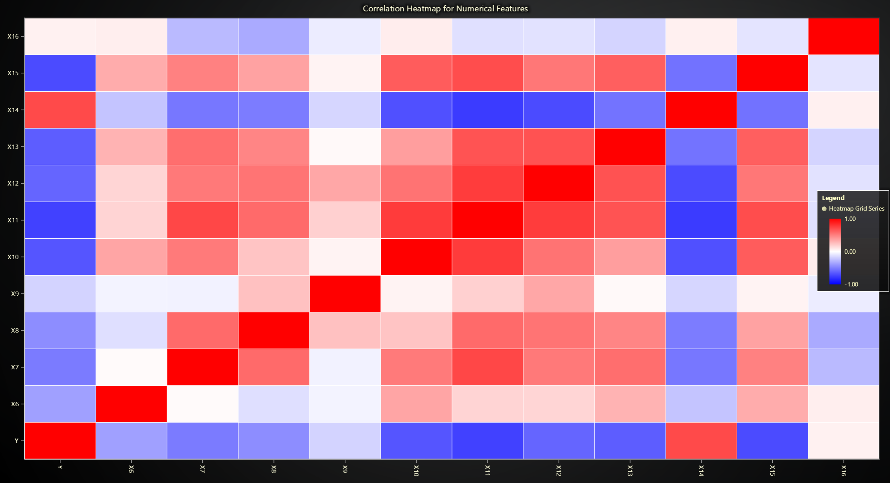
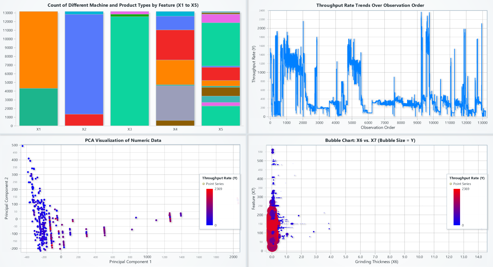
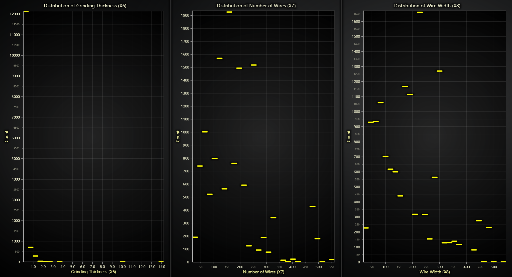
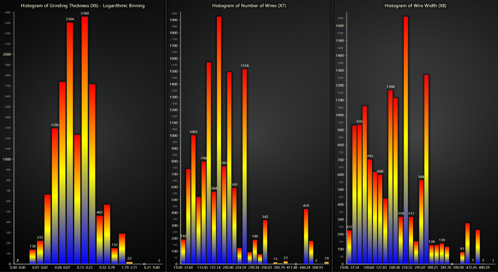
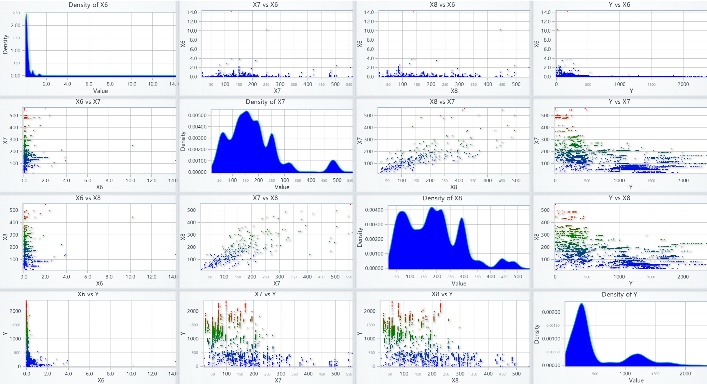
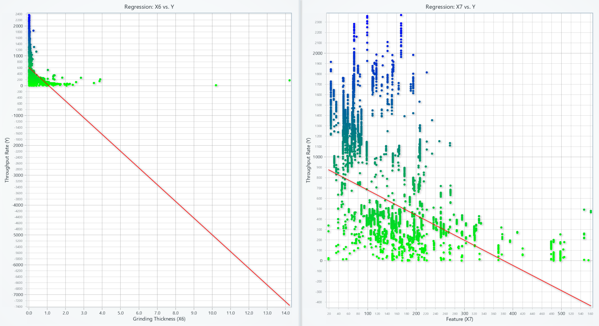
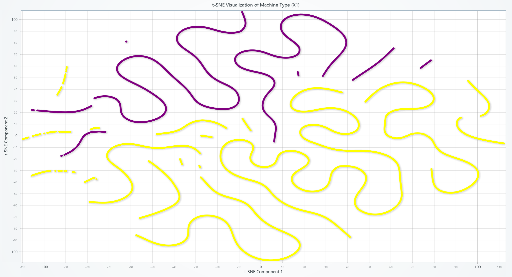

# **Introduction to Semiconductor Assembly and Testing Processes Analysis**

Unlock insights with semiconductor assembly analysis. This field examines the crucial processes of assembling and testing semiconductor devices. Understanding these stages is vital for optimizing quality and yield in the semiconductor industry.

### **What is semiconductor assembly??**
Semiconductor assembly analysis delves into the packaging of integrated circuits into final products. This involves intricate processes like die attach, wire bonding, and encapsulation, all critical for device performance and reliability. Effective semiconductor assembly analysis ensures these steps are optimized.

### **What do testing processes in the semiconductor industry mean?**  
Testing processes, a key focus of semiconductor assembly analysis, involve rigorous checks at various stages to ensure functionality and identify defects. From wafer probing to final package testing, thorough analysis of these processes is essential for delivering reliable semiconductor devices.

### **How is semiconductor assembly data collected?**  
Effective semiconductor assembly analysis relies on meticulous data collection throughout the assembly process. This includes monitoring parameters like temperature, pressure, and electrical characteristics, providing valuable insights for process optimization and quality control.
________________________________________

## **LightningChart Python** 

### **Overview of LightningChart Python**   
LightningChart is a high-performance data visualization library that offers real-time rendering and different interactive charts that makes it ideal tool for vibration analysis. 

### **Why Use LightningChart?** 
•	Real-time Performance – Handling millions of data points without lag.
•	Interactive Visualizations – Zoom, pan, and explore data interactively.
•	Multi-chart Dashboards – Combine multiple plots in one view.
•	Customization – Adjust colors, scales, legends, and interactivity.

### **Features and Chart Types Used in This Project**   
For this project, we use LightningChart to visualize machine vibration and throughput analysis  for the following chart types:
•	Time Series Graphs – Track machine vibration over time.
•	Heatmaps – Show correlations between different machine features.
•	Histograms – Analyze feature distributions like wire width and grinding thickness.
•	Scatter & Bubble Charts – Visualize relationships between variables.
•	Boxplots – Identify variations in throughput rates.
•	Regression Plots – Examine dependencies between features and throughput.
•	t-SNE & PCA – Reduce dimensionality and visualize machine types.
________________________________________

## **Performance Characteristics**   
LightningChart has great performance in processing real-time data without slowdowns. It supports parallel rendering, GPU acceleration, and efficient data streaming  that makes it perfect tool for large-scale industrial applications.
________________________________________

## **Setting Up Python Environment**   
To use LightningChart, install Python and the necessary libraries.

1. Installing Python and Required Libraries  
Make sure you have Python installed, then install the required packages:

```bash

pip install numpy pandas lightningchart matplotlib seaborn scikit-learn xgboost


2. Overview of Libraries Used  
• NumPy & Pandas – Handling and processing numerical data.  
• LightningChart – Creating real-time, interactive visualizations.  
• Matplotlib & Seaborn – Additional plotting and statistical analysis.  
• Scikit-learn – Machine learning and dimensionality reduction.  
• XGBoost – Predictive modeling and regression analysis.

3. Setting Up the Development Environment  
1. Set up a virtual environment:

python -m venv rf_analysis_env
source rf_analysis_env/bin/activate  # On Windows: rf_analysis_env\Scripts\activate
```
2. Use **Visual Studio Code (VSCode)** for a streamlined development experience.

---

________________________________________

Loading and Processing Data

1. Loading the Data Files  
Our dataset contains semiconductor assembly and testing machine data, with categorical and numerical attributes. Load it using Pandas:

```python
import pandas as pd  
data = pd.read_csv('mixed_categorical_numerical_data.csv')  
```

2. Handling and Preprocessing the Data  
•	Convert categorical data to numerical using one-hot encoding:

```python
from sklearn.preprocessing import OneHotEncoder  
encoder = OneHotEncoder(sparse_output=False, drop="first")  
encoded_data = encoder.fit_transform(data[['X1', 'X2', 'X3', 'X4', 'X5']])
```

•	Normalize numerical values for better visualization:

```python
from sklearn.preprocessing import MinMaxScaler  
scaler = MinMaxScaler()  
data_scaled = scaler.fit_transform(data[['X6', 'X7', 'X8', 'Y']])
```

•	Handle missing values:

```python
data.fillna(data.mean(), inplace=True)
```

________________________________________

Visualizing Data with LightningChart

Introduction to LightningChart for Python  
LightningChart enables real-time, high-speed visualization. We use it to determine machine behavior, find anomalies, and optimize operations.
________________________________________

Creating Charts with LightningChart

1. Box Plot (Throughput Rate by Recipe Type)  
This chart shows the distribution of throughput rates for different recipe types (X5). It highlights the median, quartiles, and outliers.

Script Summary:
```
categories = data['X5'].unique()
box_data = [{'start': i, 'end': i+0.5, 'median': np.median(data[data['X5'] == i]['Y'])} for i in categories]
chart_box = lc.ChartXY().set_title('Throughput Rate by Recipe Type')
chart_box.add_box_series().add_multiple(box_data)
```
  

2. Cumulative Throughput Rate (By Machine and Product Type)  
These area charts visualize the cumulative throughput over time for different machines (X1) and product types. It helps track production efficiency.

Script Summary:
```
data['Cumulative_Y'] = data.groupby('X1')['Y'].cumsum()
data['Cumulative_Y_Product'] = data.groupby('X2')['Y'].cumsum()
chart_cumulative = lc.ChartXY().set_title("Cumulative Throughput by Machine Type")
chart_cumulative.add_line_series().append_samples(x=data.index, y=data['Cumulative_Y'])
```
  

3. Correlation Heatmap  
A heatmap displays the correlation between numerical features, where red indicates a strong positive relationship and blue represents a strong negative correlation.

Script Summary:
```
corr_matrix = data.corr().to_numpy()
heatmap = chart.add_heatmap_grid_series(rows=corr_matrix.shape[0], columns=corr_matrix.shape[1])
heatmap.invalidate_intensity_values(corr_matrix.tolist())
```
  

4. Dashboard View (Multiple Charts)  
A combined visualization that includes:
•	Stacked Bar Chart: Counts of machine and product types.  
•	Time Series Chart: Throughput rate over time.  
•	PCA Scatter Plot: Principal Component Analysis of numeric data.  
•	Bubble Chart: Grinding thickness vs. wire count, with throughput rate shown as bubble size.

Script Summary:
```
category_counts = {col: data[col].value_counts().to_dict() for col in ['X1', 'X2', 'X3', 'X4', 'X5']}
bar_data = [{'subCategory': key, 'values': list(value.values())} for key, value in category_counts.items()]
chart_bar = dashboard.BarChart().set_title("Machine & Product Types").set_data_stacked(list(category_counts.keys()), bar_data)
```
  

5. Distribution of Features  
Step charts display the distribution of grinding thickness (X6), number of wires (X7), and wire width (X8).

Script Summary:
```
bins = {col: np.linspace(data[col].min(), data[col].max(), 30) for col in ['X6', 'X7', 'X8']}
hist_data = {col: np.histogram(data[col], bins=bins[col])[0] for col in bins}
chart_dist = dashboard.ChartXY().set_title("Feature Distribution").add_step_series().append_samples(hist_data['X6'])
```
  

6. Histograms  
Histograms with color-coded intensity show the distribution of X6, X7, and X8 values using logarithmic and linear binning.

Script Summary:
```
bins_x6 = np.logspace(np.log10(data['X6'].min() + 1e-6), np.log10(data['X6'].max()), 30)
counts_x6, bin_edges_x6 = np.histogram(data['X6'], bins=bins_x6)
chart_histogram = dashboard.BarChart().set_title("Histogram of X6").set_data([{"category": f"{bin_edges_x6[i]:.2f}", "value": int(count)} for i, count in enumerate(counts_x6)])
```
  

7. Pair Plot (Feature Relationships)  
A grid of scatter plots and density plots shows relationships between features such as X6, X7, X8, and throughput rate (Y).

Script Summary:
```
features = ['X6', 'X7', 'X8', 'Y']
for i, y_col in enumerate(features):
    for j, x_col in enumerate(features):
        if i == j:
            chart_density = dashboard.ChartXY().set_title(f'Density of {x_col}')
            chart_density.add_area_series().append_samples(x=data[x_col], y=np.random.rand(len(data)))
        else:
            chart_scatter = dashboard.ChartXY().set_title(f'{x_col} vs {y_col}')
            chart_scatter.add_point_series().append_samples(x=data[x_col], y=data[y_col])
```
  

8. Real-Time Predictions (XGBoost Model)  
•	The first chart compares actual vs. predicted values using an XGBoost regression model.  
•	The second chart is a certainty heatmap showing confidence in predictions over time.

Script Summary:
```
model = XGBRegressor().fit(X_train, y_train)
y_pred = model.predict(X_test)
residuals = np.abs(y_test - y_pred)
heatmap_data = [1 - (res / max(residuals)) for res in residuals]
chart_real_time = dashboard.ChartXY().set_title("Real-Time Predictions").add_heatmap_grid_series().invalidate_intensity_values(heatmap_data)
```
  

9. Regression Analysis  
Regression plots for Grinding Thickness (X6) vs. Throughput (Y) and Number of Wires (X7) vs. Throughput (Y) show trend lines fitted to the data.

Script Summary:
```
reg_x6 = LinearRegression().fit(data[['X6']], data['Y'])
y_x6_pred = reg_x6.predict(np.linspace(data['X6'].min(), data['X6'].max(), 100).reshape(-1, 1))
chart_reg = dashboard.ChartXY().set_title("Regression: X6 vs Y")
chart_reg.add_line_series().append_samples(x=data['X6'], y=y_x6_pred)
```
  

10. t-SNE Visualization  
A t-SNE plot represents machine types (X1) in a 2D space, helping to visualize patterns and clusters in the data.

Script Summary:
```
tsne_result = TSNE(n_components=2, random_state=42).fit_transform(data.drop(columns=['X1', 'X2', 'X3', 'X4', 'X5', 'Y']))
chart_tsne = lc.ChartXY().set_title("t-SNE Machine Type").add_point_series().append_samples(x=tsne_result[:, 0], y=tsne_result[:, 1])
```
  
________________________________________

Conclusion  
This project shows how LightningChart can be used for high-performance data visualization in industrial applications. It helps to analyze throughput variations, find correlations, and track production trends. Additionally, machine learning techniques like XGBoost regression and t-SNE clustering can be used to monitor production performance.

By using Python with LightningChart, NumPy, Pandas, and Scikit-learn, we can visualize complex data in interactive way.
